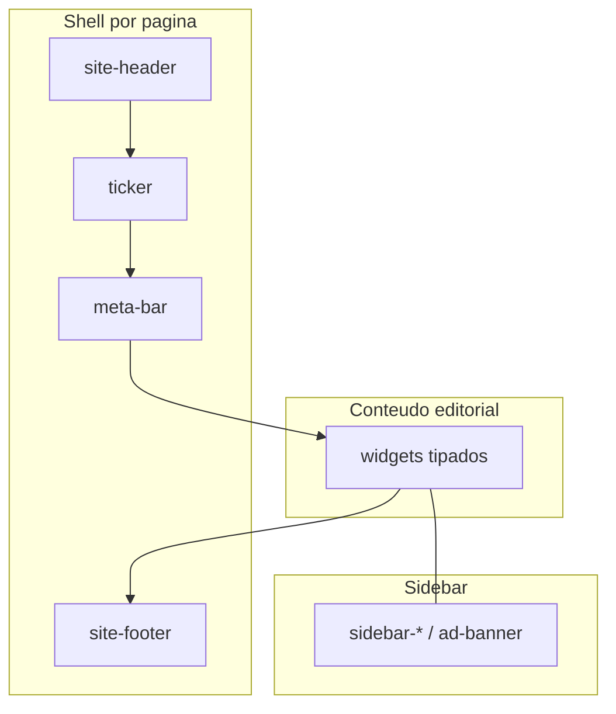

# Screen Map — Notícias Mobile

Mapa de telas e widgets do template HTML. Contrato para direcionamento futuro de conteúdo por `data-widget-id`.

Fontes: [`screen-map.json`](../screen-map.json) · categorias: [`CATEGORIES.md`](CATEGORIES.md) · tags: [`TAGS.md`](TAGS.md) · schema: [`domain/DATABASE-SCHEMA.md`](domain/DATABASE-SCHEMA.md) · banners/publicidade: [`BANNER-FORMATS.md`](BANNER-FORMATS.md).

## Convenção de IDs

| Atributo | Formato | Exemplo |
|----------|---------|---------|
| `id` (DOM) | `{pageId}__{slot}` | `home-1__hero` |
| `data-widget-id` | `{pageId}.{slot}` | `home-1.hero` |
| `data-widget-type` | kebab | `hero-mosaic` |

- Slots aninhados: `home-1.sidebar.recent` → DOM `home-1__sidebar-recent`.
- Header, ticker e footer são **por página** para targeting independente.
- Cards internos não recebem `data-widget-id`; artigos usam IDs do CMS.
- Badges de categoria (`topic-box`) → ver [`CATEGORIES.md`](CATEGORIES.md).

## Composição

## Catálogo de tipos

| type | Descrição |
|------|-----------|
| `site-header` | Cabeçalho do site (logo, menu, busca) |
| `ticker` | Feed/ticker de notícias no topo |
| `meta-bar` | Barra de info (local, data, clima) ou info de localização |
| `breadcrumbs` | Trilha de navegação |
| `hero-mosaic` | Hero mosaico com overlay de destaques |
| `hero-banner` | Hero/banner full-width ou banner interno |
| `hero-nivo` | Slider Nivo (home-7) |
| `isotope-section` | Seção com filtros Isotope (Top/Popular/More Stories) |
| `media-list` | Lista horizontal .media (thumb + texto) |
| `card-grid` | Grid de cards de notícias |
| `overlay-list` | Lista/grid com overlay de imagem |
| `video-section` | Bloco de vídeos |
| `video-carousel` | Carrossel de vídeos |
| `category-boxes` | Caixas de categoria (.category-box-layout1) |
| `category-news` | Coluna de notícias por categoria |
| `news-carousel` | Carrossel Owl (.ne-carousel) |
| `featured-section` | Seção de destaques / feature / about |
| `trending-section` | Posts em alta (trending) |
| `international-section` | Bloco International Story |
| `more-news` | Bloco More News (sem isotope) |
| `latest-news` | Bloco Latest News / Latest Articles |
| `review-section` | Reviews (games/food) |
| `ad-banner` | Banner publicitário (`.ne-banner-layout*`) — tamanhos e slots: [`BANNER-FORMATS.md`](BANNER-FORMATS.md) |
| `sidebar-social` | Stay Connected / redes sociais |
| `sidebar-recent` | Recent / Popular tabs na sidebar |
| `sidebar-newsletter` | Newsletter |
| `sidebar-tags` | Nuvem de tags |
| `sidebar-reviews` | Most/Latest Reviews |
| `article-body` | Corpo do artigo |
| `article-tags` | Tags do artigo |
| `article-share` | Compartilhar post |
| `article-nav` | Navegação anterior/próximo artigo |
| `article-author` | Box do autor / perfil |
| `article-comments` | Comentários e formulário |
| `related-carousel` | Posts relacionados em carrossel |
| `archive-filters` | Filtros de arquivo |
| `gallery-grid` | Grade de galeria |
| `contact-form` | Formulário de contato |
| `error-message` | Mensagem de erro 404 |
| `site-footer` | Rodapé do site |

## Aliases de arquivos

| Canônico | Alias |
|----------|-------|
| `index.html` (`home-1`) | `index-2.html` |
| `single-news-1.html` (`article-1`) | `single-news-4.html` |
| `gallery-style-1.html` (`gallery-1`) | `gallery-style1.html` |
| `gallery-style-2.html` (`gallery-2`) | `gallery-style2.html` |

## Páginas e widgets

### `home-1` — Home 1

Arquivo: [`index.html`](index.html) · aliases: `index-2.html`

| widget-id | type | label | region |
|-----------|------|-------|--------|
| `home-1.header` | `site-header` | Cabeçalho | main |
| `home-1.ticker` | `ticker` | Ticker de Notícias | main |
| `home-1.meta-bar` | `meta-bar` | Barra de Infos | main |
| `home-1.hero` | `hero-mosaic` | Slider de Notícias | main |
| `home-1.top-stories` | `isotope-section` | Destaques | main |
| `home-1.lifestyle` | `overlay-list` | Lifestyle | main |
| `home-1.sidebar.social` | `sidebar-social` | Redes Sociais | sidebar |
| `home-1.sidebar.ad-1` | `ad-banner` | Anúncio Sidebar | sidebar |
| `home-1.sidebar.recent` | `sidebar-recent` | Notícias Recentes | sidebar |
| `home-1.ad-after-top` | `ad-banner` | Banner Após Destaques | main |
| `home-1.video` | `video-section` | Área de Vídeos | main |
| `home-1.tech-world` | `media-list` | Mundo Tech | main |
| `home-1.health-fitness` | `media-list` | Saúde & Fitness | main |
| `home-1.tech-world-2` | `media-list` | Mundo Tech (2) | main |
| `home-1.ad-latest` | `ad-banner` | Banner Últimas Notícias | main |
| `home-1.sports` | `isotope-section` | Esportes | main |
| `home-1.more-news` | `isotope-section` | Mais Notícias | main |
| `home-1.sidebar.ad-2` | `ad-banner` | Anúncio Sidebar (2) | sidebar |
| `home-1.sidebar.newsletter` | `sidebar-newsletter` | Newsletter | sidebar |
| `home-1.categories` | `category-boxes` | Área de Categorias | main |
| `home-1.footer` | `site-footer` | Rodapé | main |

### `home-2` — Home 2

Arquivo: [`index2.html`](index2.html)

| widget-id | type | label | region |
|-----------|------|-------|--------|
| `home-2.header` | `site-header` | Cabeçalho | main |
| `home-2.ticker` | `ticker` | Ticker de Notícias | main |
| `home-2.hero` | `hero-mosaic` | Slider de Notícias | main |
| `home-2.top-stories` | `isotope-section` | Destaques | main |
| `home-2.ad-after-top` | `ad-banner` | Banner Após Destaques | main |
| `home-2.international` | `international-section` | Internacional | main |
| `home-2.sidebar.social` | `sidebar-social` | Redes Sociais | sidebar |
| `home-2.sidebar.ad-1` | `ad-banner` | Anúncio Sidebar | sidebar |
| `home-2.editor-picks` | `news-carousel` | Escolha do Editor | main |
| `home-2.fashion` | `category-news` | Moda | main |
| `home-2.tech-world` | `category-news` | Mundo Tech | main |
| `home-2.food-hobbies` | `category-news` | Gastronomia & Hobbies | main |
| `home-2.ad-category` | `ad-banner` | Banner Categorias | main |
| `home-2.video` | `video-section` | Área de Vídeos | main |
| `home-2.more-news` | `isotope-section` | Mais Notícias | main |
| `home-2.sidebar.reviews` | `sidebar-reviews` | Últimas Avaliações | sidebar |
| `home-2.sidebar.newsletter` | `sidebar-newsletter` | Newsletter | sidebar |
| `home-2.footer` | `site-footer` | Rodapé | main |

### `home-3` — Home 3

Arquivo: [`index3.html`](index3.html)

| widget-id | type | label | region |
|-----------|------|-------|--------|
| `home-3.header` | `site-header` | Cabeçalho | main |
| `home-3.ticker` | `ticker` | Ticker de Notícias | main |
| `home-3.hero` | `hero-mosaic` | Slider de Notícias | main |
| `home-3.whats-new` | `isotope-section` | Novidades | main |
| `home-3.android` | `media-list` | Android | main |
| `home-3.accessories` | `media-list` | Acessórios | main |
| `home-3.sidebar.social` | `sidebar-social` | Redes Sociais | sidebar |
| `home-3.sidebar.ad-1` | `ad-banner` | Anúncio Sidebar | sidebar |
| `home-3.sidebar.recent` | `sidebar-recent` | Notícias Recentes | sidebar |
| `home-3.ad-after-top` | `ad-banner` | Banner Após Destaques | main |
| `home-3.video` | `video-section` | Assistir Vídeos | main |
| `home-3.gadgets` | `card-grid` | Gadgets | main |
| `home-3.latest-news` | `latest-news` | Últimas Notícias | main |
| `home-3.sidebar.reviews` | `sidebar-reviews` | Mais Avaliados | sidebar |
| `home-3.sidebar.newsletter` | `sidebar-newsletter` | Newsletter | sidebar |
| `home-3.footer` | `site-footer` | Rodapé | main |

### `home-4` — Home 4

Arquivo: [`index4.html`](index4.html)

| widget-id | type | label | region |
|-----------|------|-------|--------|
| `home-4.header` | `site-header` | Cabeçalho | main |
| `home-4.ticker` | `ticker` | Ticker de Notícias | main |
| `home-4.hero` | `hero-mosaic` | Slider de Notícias | main |
| `home-4.popular-games` | `isotope-section` | Games Populares | main |
| `home-4.games-reviews` | `review-section` | Reviews de Games | main |
| `home-4.sidebar.social` | `sidebar-social` | Redes Sociais | sidebar |
| `home-4.sidebar.recent` | `sidebar-recent` | Recentes / Populares | sidebar |
| `home-4.video` | `video-section` | Assistir Vídeos | main |
| `home-4.footer` | `site-footer` | Rodapé | main |

### `home-5` — Home 5

Arquivo: [`index5.html`](index5.html)

| widget-id | type | label | region |
|-----------|------|-------|--------|
| `home-5.header` | `site-header` | Cabeçalho | main |
| `home-5.ticker` | `ticker` | Ticker de Notícias | main |
| `home-5.hero` | `hero-mosaic` | Slider de Notícias | main |
| `home-5.popular-news` | `isotope-section` | Notícias Populares | main |
| `home-5.racing-world` | `overlay-list` | Mundo das Corridas | main |
| `home-5.sidebar.social` | `sidebar-social` | Redes Sociais | sidebar |
| `home-5.sidebar.ad-1` | `ad-banner` | Anúncio Sidebar | sidebar |
| `home-5.sidebar.recent` | `sidebar-recent` | Notícias Recentes | sidebar |
| `home-5.video` | `video-section` | Assistir Vídeos | main |
| `home-5.latest-article` | `latest-news` | Último Artigo | main |
| `home-5.sidebar.categories` | `category-boxes` | Categorias | sidebar |
| `home-5.sidebar.ad-2` | `ad-banner` | Anúncio Sidebar (2) | sidebar |
| `home-5.sidebar.reviews` | `sidebar-reviews` | Mais Avaliados | sidebar |
| `home-5.footer` | `site-footer` | Rodapé | main |

### `home-6` — Home 6

Arquivo: [`index6.html`](index6.html)

| widget-id | type | label | region |
|-----------|------|-------|--------|
| `home-6.header` | `site-header` | Cabeçalho | main |
| `home-6.hero` | `hero-banner` | Slider de Notícias | main |
| `home-6.featured` | `featured-section` | Notícias em Destaque | main |
| `home-6.latest-articles` | `latest-news` | Últimos Artigos | main |
| `home-6.sidebar.social` | `sidebar-social` | Redes Sociais | sidebar |
| `home-6.sidebar.ad-1` | `ad-banner` | Anúncio Sidebar | sidebar |
| `home-6.sidebar.recent` | `sidebar-recent` | Notícias Recentes | sidebar |
| `home-6.trending` | `trending-section` | Em Alta | main |
| `home-6.categories` | `category-boxes` | Área de Categorias | main |
| `home-6.more-news` | `more-news` | Mais Notícias | main |
| `home-6.sidebar.reviews` | `sidebar-reviews` | Últimas Avaliações | sidebar |
| `home-6.sidebar.ad-2` | `ad-banner` | Anúncio Sidebar (2) | sidebar |
| `home-6.sidebar.newsletter` | `sidebar-newsletter` | Newsletter | sidebar |
| `home-6.footer` | `site-footer` | Rodapé | main |

### `home-7` — Home 7

Arquivo: [`index7.html`](index7.html)

| widget-id | type | label | region |
|-----------|------|-------|--------|
| `home-7.header` | `site-header` | Cabeçalho | main |
| `home-7.ticker` | `ticker` | Ticker de Notícias | main |
| `home-7.hero` | `hero-nivo` | Slider Nivo | main |
| `home-7.hero-side` | `media-list` | Laterais do Slider | main |
| `home-7.popular-recipes` | `isotope-section` | Receitas Populares | main |
| `home-7.food-reviews` | `review-section` | Reviews Gastronômicos | main |
| `home-7.sidebar.social` | `sidebar-social` | Redes Sociais | sidebar |
| `home-7.sidebar.recent` | `sidebar-recent` | Abas Recentes / Populares | sidebar |
| `home-7.video` | `video-carousel` | Assistir Vídeos | main |
| `home-7.categories` | `category-boxes` | Área de Categorias | main |
| `home-7.footer` | `site-footer` | Rodapé | main |

### `post-1` — Post Style 1

Arquivo: [`post-style-1.html`](post-style-1.html)

| widget-id | type | label | region |
|-----------|------|-------|--------|
| `post-1.header` | `site-header` | Cabeçalho | main |
| `post-1.ticker` | `ticker` | Ticker de Notícias | main |
| `post-1.meta-bar` | `meta-bar` | Barra de Infos | main |
| `post-1.breadcrumbs` | `breadcrumbs` | Breadcrumb | main |
| `post-1.list` | `media-list` | Lista Post Style 1 | main |
| `post-1.sidebar.social` | `sidebar-social` | Redes Sociais | sidebar |
| `post-1.sidebar.ad` | `ad-banner` | Anúncio Sidebar | sidebar |
| `post-1.sidebar.newsletter` | `sidebar-newsletter` | Newsletter | sidebar |
| `post-1.sidebar.tags` | `sidebar-tags` | Tags | sidebar |
| `post-1.footer` | `site-footer` | Rodapé | main |

### `post-2` — Post Style 2

Arquivo: [`post-style-2.html`](post-style-2.html)

| widget-id | type | label | region |
|-----------|------|-------|--------|
| `post-2.header` | `site-header` | Cabeçalho | main |
| `post-2.ticker` | `ticker` | Ticker de Notícias | main |
| `post-2.meta-bar` | `meta-bar` | Barra de Infos | main |
| `post-2.breadcrumbs` | `breadcrumbs` | Breadcrumb | main |
| `post-2.list` | `card-grid` | Grade Post Style 2 | main |
| `post-2.sidebar.social` | `sidebar-social` | Redes Sociais | sidebar |
| `post-2.sidebar.ad` | `ad-banner` | Anúncio Sidebar | sidebar |
| `post-2.sidebar.newsletter` | `sidebar-newsletter` | Newsletter | sidebar |
| `post-2.sidebar.tags` | `sidebar-tags` | Tags | sidebar |
| `post-2.footer` | `site-footer` | Rodapé | main |

### `post-3` — Post Style 3

Arquivo: [`post-style-3.html`](post-style-3.html)

| widget-id | type | label | region |
|-----------|------|-------|--------|
| `post-3.header` | `site-header` | Cabeçalho | main |
| `post-3.ticker` | `ticker` | Ticker de Notícias | main |
| `post-3.meta-bar` | `meta-bar` | Barra de Infos | main |
| `post-3.breadcrumbs` | `breadcrumbs` | Breadcrumb | main |
| `post-3.list` | `media-list` | Lista Post Style 3 | main |
| `post-3.sidebar.social` | `sidebar-social` | Redes Sociais | sidebar |
| `post-3.sidebar.ad` | `ad-banner` | Anúncio Sidebar | sidebar |
| `post-3.sidebar.newsletter` | `sidebar-newsletter` | Newsletter | sidebar |
| `post-3.sidebar.reviews` | `sidebar-reviews` | Mais Avaliados | sidebar |
| `post-3.sidebar.tags` | `sidebar-tags` | Tags | sidebar |
| `post-3.footer` | `site-footer` | Rodapé | main |

### `post-4` — Post Style 4

Arquivo: [`post-style-4.html`](post-style-4.html)

| widget-id | type | label | region |
|-----------|------|-------|--------|
| `post-4.header` | `site-header` | Cabeçalho | main |
| `post-4.ticker` | `ticker` | Ticker de Notícias | main |
| `post-4.meta-bar` | `meta-bar` | Barra de Infos | main |
| `post-4.breadcrumbs` | `breadcrumbs` | Breadcrumb | main |
| `post-4.list` | `overlay-list` | Lista Post Style 4 | main |
| `post-4.sidebar.social` | `sidebar-social` | Redes Sociais | sidebar |
| `post-4.sidebar.ad` | `ad-banner` | Anúncio Sidebar | sidebar |
| `post-4.sidebar.newsletter` | `sidebar-newsletter` | Newsletter | sidebar |
| `post-4.sidebar.reviews` | `sidebar-reviews` | Mais Avaliados | sidebar |
| `post-4.sidebar.tags` | `sidebar-tags` | Tags | sidebar |
| `post-4.footer` | `site-footer` | Rodapé | main |

### `archive` — Archive

Arquivo: [`archive.html`](archive.html)

| widget-id | type | label | region |
|-----------|------|-------|--------|
| `archive.header` | `site-header` | Cabeçalho | main |
| `archive.ticker` | `ticker` | Ticker de Notícias | main |
| `archive.meta-bar` | `meta-bar` | Barra de Infos | main |
| `archive.breadcrumbs` | `breadcrumbs` | Breadcrumb | main |
| `archive.filters` | `archive-filters` | Filtros de Arquivo | main |
| `archive.list` | `media-list` | Posts do Arquivo | main |
| `archive.sidebar.archives` | `archive-filters` | Arquivo | sidebar |
| `archive.sidebar.ad` | `ad-banner` | Anúncio Sidebar | sidebar |
| `archive.sidebar.newsletter` | `sidebar-newsletter` | Newsletter | sidebar |
| `archive.footer` | `site-footer` | Rodapé | main |

### `author` — Author Post

Arquivo: [`author-post.html`](author-post.html)

| widget-id | type | label | region |
|-----------|------|-------|--------|
| `author.header` | `site-header` | Cabeçalho | main |
| `author.ticker` | `ticker` | Ticker de Notícias | main |
| `author.meta-bar` | `meta-bar` | Barra de Infos | main |
| `author.breadcrumbs` | `breadcrumbs` | Breadcrumb | main |
| `author.profile` | `article-author` | Perfil do Autor | main |
| `author.list` | `media-list` | Posts do Autor | main |
| `author.sidebar.social` | `sidebar-social` | Redes Sociais | sidebar |
| `author.sidebar.ad` | `ad-banner` | Anúncio Sidebar | sidebar |
| `author.sidebar.newsletter` | `sidebar-newsletter` | Newsletter | sidebar |
| `author.sidebar.tags` | `sidebar-tags` | Tags | sidebar |
| `author.footer` | `site-footer` | Rodapé | main |

### `article-1` — News Details 1

Arquivo: [`single-news-1.html`](single-news-1.html) · aliases: `single-news-4.html`

| widget-id | type | label | region |
|-----------|------|-------|--------|
| `article-1.header` | `site-header` | Cabeçalho | main |
| `article-1.ticker` | `ticker` | Ticker de Notícias | main |
| `article-1.meta-bar` | `meta-bar` | Barra de Infos | main |
| `article-1.breadcrumbs` | `breadcrumbs` | Breadcrumb | main |
| `article-1.body` | `article-body` | Corpo do Artigo | main |
| `article-1.tags` | `article-tags` | Tags do Artigo | main |
| `article-1.share` | `article-share` | Compartilhar | main |
| `article-1.nav` | `article-nav` | Artigo Anterior / Próximo | main |
| `article-1.author` | `article-author` | Box do Autor | main |
| `article-1.comments` | `article-comments` | Comentários | main |
| `article-1.sidebar.social` | `sidebar-social` | Redes Sociais | sidebar |
| `article-1.sidebar.ad` | `ad-banner` | Anúncio Sidebar | sidebar |
| `article-1.sidebar.recent` | `sidebar-recent` | Notícias Recentes | sidebar |
| `article-1.sidebar.newsletter` | `sidebar-newsletter` | Newsletter | sidebar |
| `article-1.sidebar.tags` | `sidebar-tags` | Tags | sidebar |
| `article-1.sidebar.reviews` | `sidebar-reviews` | Mais Avaliados | sidebar |
| `article-1.footer` | `site-footer` | Rodapé | main |

### `article-2` — News Details 2

Arquivo: [`single-news-2.html`](single-news-2.html)

| widget-id | type | label | region |
|-----------|------|-------|--------|
| `article-2.header` | `site-header` | Cabeçalho | main |
| `article-2.ticker` | `ticker` | Ticker de Notícias | main |
| `article-2.meta-bar` | `meta-bar` | Barra de Infos | main |
| `article-2.breadcrumbs` | `breadcrumbs` | Breadcrumb | main |
| `article-2.hero` | `hero-banner` | Hero do Artigo | main |
| `article-2.body` | `article-body` | Corpo do Artigo | main |
| `article-2.tags` | `article-tags` | Tags do Artigo | main |
| `article-2.share` | `article-share` | Compartilhar | main |
| `article-2.nav` | `article-nav` | Artigo Anterior / Próximo | main |
| `article-2.author` | `article-author` | Box do Autor | main |
| `article-2.related` | `related-carousel` | Posts Relacionados | main |
| `article-2.comments` | `article-comments` | Comentários | main |
| `article-2.sidebar.social` | `sidebar-social` | Redes Sociais | sidebar |
| `article-2.sidebar.ad` | `ad-banner` | Anúncio Sidebar | sidebar |
| `article-2.sidebar.recent` | `sidebar-recent` | Abas Recentes / Populares | sidebar |
| `article-2.sidebar.newsletter` | `sidebar-newsletter` | Newsletter | sidebar |
| `article-2.sidebar.tags` | `sidebar-tags` | Tags | sidebar |
| `article-2.footer` | `site-footer` | Rodapé | main |

### `article-3` — News Details 3

Arquivo: [`single-news-3.html`](single-news-3.html)

| widget-id | type | label | region |
|-----------|------|-------|--------|
| `article-3.header` | `site-header` | Cabeçalho | main |
| `article-3.ticker` | `ticker` | Ticker de Notícias | main |
| `article-3.meta-bar` | `meta-bar` | Barra de Infos | main |
| `article-3.hero` | `hero-banner` | Banner Interno | main |
| `article-3.breadcrumbs` | `breadcrumbs` | Breadcrumb | main |
| `article-3.body` | `article-body` | Corpo do Artigo | main |
| `article-3.tags` | `article-tags` | Tags do Artigo | main |
| `article-3.share` | `article-share` | Compartilhar | main |
| `article-3.nav` | `article-nav` | Artigo Anterior / Próximo | main |
| `article-3.author` | `article-author` | Box do Autor | main |
| `article-3.comments` | `article-comments` | Comentários | main |
| `article-3.sidebar.social` | `sidebar-social` | Redes Sociais | sidebar |
| `article-3.sidebar.ad` | `ad-banner` | Anúncio Sidebar | sidebar |
| `article-3.sidebar.recent` | `sidebar-recent` | Notícias Recentes | sidebar |
| `article-3.sidebar.newsletter` | `sidebar-newsletter` | Newsletter | sidebar |
| `article-3.sidebar.tags` | `sidebar-tags` | Tags | sidebar |
| `article-3.footer` | `site-footer` | Rodapé | main |

### `gallery-1` — Gallery Style 1

Arquivo: [`gallery-style-1.html`](gallery-style-1.html) · aliases: `gallery-style1.html`

| widget-id | type | label | region |
|-----------|------|-------|--------|
| `gallery-1.header` | `site-header` | Cabeçalho | main |
| `gallery-1.ticker` | `ticker` | Ticker de Notícias | main |
| `gallery-1.meta-bar` | `meta-bar` | Barra de Infos | main |
| `gallery-1.breadcrumbs` | `breadcrumbs` | Breadcrumb | main |
| `gallery-1.grid` | `gallery-grid` | Galeria Layout 1 | main |
| `gallery-1.footer` | `site-footer` | Rodapé | main |

### `gallery-2` — Gallery Style 2

Arquivo: [`gallery-style-2.html`](gallery-style-2.html) · aliases: `gallery-style2.html`

| widget-id | type | label | region |
|-----------|------|-------|--------|
| `gallery-2.header` | `site-header` | Cabeçalho | main |
| `gallery-2.ticker` | `ticker` | Ticker de Notícias | main |
| `gallery-2.meta-bar` | `meta-bar` | Barra de Infos | main |
| `gallery-2.breadcrumbs` | `breadcrumbs` | Breadcrumb | main |
| `gallery-2.grid` | `gallery-grid` | Galeria Layout 2 | main |
| `gallery-2.footer` | `site-footer` | Rodapé | main |

### `contact` — Contact

Arquivo: [`contact.html`](contact.html)

| widget-id | type | label | region |
|-----------|------|-------|--------|
| `contact.header` | `site-header` | Cabeçalho | main |
| `contact.ticker` | `ticker` | Ticker de Notícias | main |
| `contact.meta-bar` | `meta-bar` | Barra de Infos | main |
| `contact.breadcrumbs` | `breadcrumbs` | Breadcrumb | main |
| `contact.about` | `featured-section` | Sobre Nós | main |
| `contact.location` | `meta-bar` | Localização | main |
| `contact.form` | `contact-form` | Envie uma Mensagem | main |
| `contact.sidebar.social` | `sidebar-social` | Redes Sociais | sidebar |
| `contact.sidebar.ad` | `ad-banner` | Anúncio Sidebar | sidebar |
| `contact.sidebar.newsletter` | `sidebar-newsletter` | Newsletter | sidebar |
| `contact.footer` | `site-footer` | Rodapé | main |

### `privacy` — Política de Privacidade

Arquivo: [`privacy.html`](privacy.html)

| widget-id | type | label | region |
|-----------|------|-------|--------|
| `privacy.header` | `site-header` | Cabeçalho | main |
| `privacy.ticker` | `ticker` | Ticker de Notícias | main |
| `privacy.meta-bar` | `meta-bar` | Barra de Infos | main |
| `privacy.breadcrumbs` | `breadcrumbs` | Breadcrumb | main |
| `privacy.body` | `article-body` | Política de Privacidade | main |
| `privacy.sidebar.social` | `sidebar-social` | Redes Sociais | sidebar |
| `privacy.sidebar.ad` | `ad-banner` | Anúncio Sidebar | sidebar |
| `privacy.sidebar.newsletter` | `sidebar-newsletter` | Newsletter | sidebar |
| `privacy.footer` | `site-footer` | Rodapé | main |

Conteúdo do corpo ↔ tabela `privacy_policy` (versão alinhada a `js/consent.js`).

### `a11y` — Acessibilidade

Arquivo: [`acessibilidade.html`](acessibilidade.html)

| widget-id | type | label | region |
|-----------|------|-------|--------|
| `a11y.header` | `site-header` | Cabeçalho | main |
| `a11y.ticker` | `ticker` | Ticker de Notícias | main |
| `a11y.meta-bar` | `meta-bar` | Barra de Infos | main |
| `a11y.breadcrumbs` | `breadcrumbs` | Breadcrumb | main |
| `a11y.body` | `article-body` | Declaração de Acessibilidade | main |
| `a11y.sidebar.social` | `sidebar-social` | Redes Sociais | sidebar |
| `a11y.sidebar.ad` | `ad-banner` | Anúncio Sidebar | sidebar |
| `a11y.sidebar.newsletter` | `sidebar-newsletter` | Newsletter | sidebar |
| `a11y.footer` | `site-footer` | Rodapé | main |

Página pública com recursos de a11y habilitados, orientação de uso e canal de reporte de barreiras.

### `error-404` — 404 Error

Arquivo: [`404.html`](404.html)

| widget-id | type | label | region |
|-----------|------|-------|--------|
| `error-404.header` | `site-header` | Cabeçalho | main |
| `error-404.ticker` | `ticker` | Ticker de Notícias | main |
| `error-404.meta-bar` | `meta-bar` | Barra de Infos | main |
| `error-404.breadcrumbs` | `breadcrumbs` | Breadcrumb | main |
| `error-404.message` | `error-message` | Mensagem 404 | main |
| `error-404.footer` | `site-footer` | Rodapé | main |

## Uso futuro (CMS / API)

1. Layout engine resolve `pageId` → widgets em `screen-map.json` / `widget_slots`.
2. Conteúdo editorial é atribuído a um `data-widget-id` via `widget_bindings`.
3. Categoria do item usa **slug** de [`CATEGORIES.md`](CATEGORIES.md); tags usam [`TAGS.md`](TAGS.md).
4. Configuração do site, Analytics e CMP: ver [`domain/DATABASE-SCHEMA.md`](domain/DATABASE-SCHEMA.md).
5. Regenerar seeds de layout: `python3 scripts/regenerate_layout_seeds.py`.

