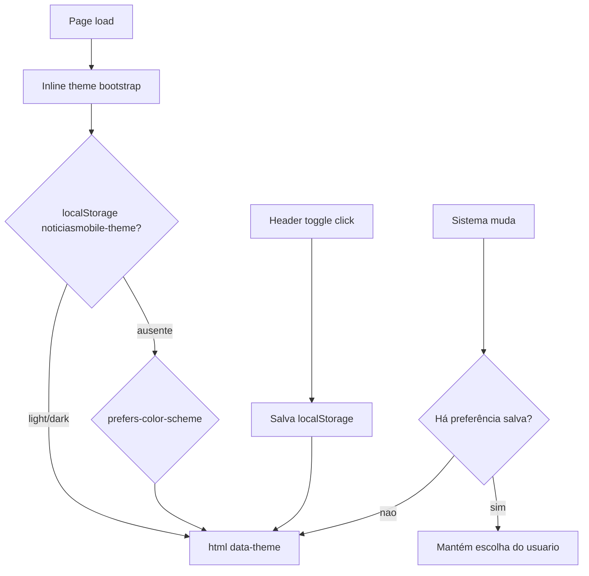

# Notícias Mobile — Style Guide

Guia de estilo padrão para novas páginas do template **Notícias Mobile**.  
Identidade visual migrada de vermelho `#e53935` para verde `#99cc00`.

---

## 1. Identidade de marca

### Cor primária

| Token | Hex | RGB | Uso |
|-------|-----|-----|-----|
| `--color-primary` | `#99cc00` | `153, 204, 0` | Links hover, menus, botões, tags, topic-box, footer |
| `--color-primary-dark` | `#7aa300` | — | Hover / pressed (~20% mais escuro) |
| `--color-primary-darker` | `#669900` | — | Estados ativos |
| `--color-primary-light` | `#eff7d8` | — | Fundos suaves, highlights |
| `--color-primary-rgb` | — | `153, 204, 0` | Overlays e sombras via `rgba(var(--color-primary-rgb), α)` |
| `--color-on-primary` | `#333333` | — | Texto sobre fundo primário (`.topic-box`, `.color-primary`) — contraste |

### Neutros (temáticos)

Valores abaixo são o tema **light**. No dark, os mesmos tokens mudam automaticamente via `[data-theme="dark"]` — ver [§9 Temas](#9-temas-light--dark).

| Token | Light | Uso |
|-------|-------|-----|
| `--color-bg` | `#e6e8eb` | Fundo da página |
| `--color-surface` | `#ffffff` | Cards, painéis, `.bg-body` |
| `--color-surface-2` | `#f8f8f8` | Superfície secundária |
| `--color-heading` | `#111111` | Títulos |
| `--color-text` | `#444444` | Corpo |
| `--color-text-muted` | `#787878` | Texto secundário |
| `--color-border` | `#dcdcdc` | Bordas |
| `--color-inverse` | `#111111` | Header escuro (`.bg-primarytextcolor`) |
| `--color-inverse-text` | `#ffffff` | Texto no header escuro |
| `--color-footer-bg` / `--color-footer-text` | `#000` / `#fff` | Footer |
| `--color-input-bg` / `--color-input-border` | `#fff` / `#dcdcdc` | Inputs |
| `--color-modal-bg` | `#ffffff` | Modal login |
| `--color-offcanvas-bg` | `#1f1f1f` | Offcanvas |
| `--color-shadow` | `rgba(0,0,0,.15)` | Sombras |
| `--color-white` | `#ffffff` | Alias fixo (ícones/botões sobre primária) |

### Tokens CSS

Definidos em [`css/variables.css`](../css/variables.css). **Nunca hardcodar** `#99cc00` nem hex neutros de superfície/texto em novas páginas — use as variáveis ou as classes utilitárias.

```css
color: var(--color-primary);
background-color: var(--color-surface);
color: var(--color-heading);
border-color: var(--color-border);
background-color: rgba(var(--color-primary-rgb), 0.3);
```

### Contraste

- **Topic boxes / badges verdes** (`.topic-box`, `.topic-box.topic-box-margin`, `.topic-box-sm.color-primary`, `.topic-box-lg.color-primary`): texto `#333333` (`--color-on-primary`) — branco não tem contraste suficiente sobre `#99cc00`. Primária e on-primary **não mudam** no dark.
- **Botões** preenchidos: texto branco continua aceitável em áreas curtas com peso alto; se o contraste falhar em QA, use `var(--color-on-primary)`.

---

## 2. Tipografia

| Papel | Família | Fonte |
|-------|---------|-------|
| Corpo | Open Sans | 300 / 400 / 600 / 700 |
| Títulos | Roboto | 300 / 400 / 500 / 700 |

### Escala base

| Elemento | Tamanho |
|----------|---------|
| `h1` | 24px |
| `h2` | 20px |
| `h3` | 16px |
| body / `p` | 16px / line-height 24px |

### Modificadores

- Títulos: `.size-sm`, `.size-lg`, `.size-xl`
- Parágrafos: `.size-sm`, `.size-lg`
- Classes de peso + cor: `.text-light-primary`, `.text-regular-primary`, `.text-medium-primary`, `.text-bold-primary`

---

## 3. Estrutura de página (boilerplate)

Ordem obrigatória no `<head>`: script anti-FOUC → CSS de vendors → `variables.css` → `style.css`.

```html
<!doctype html>
<html class="no-js" lang="pt-BR">
<head>
    <meta charset="utf-8">
    <meta http-equiv="x-ua-compatible" content="ie=edge">
    <title>Notícias Mobile | Nome da Página</title>
    <meta name="viewport" content="width=device-width, initial-scale=1">

    <link rel="shortcut icon" type="image/x-icon" href="img/favicon.png">
    <link rel="stylesheet" href="css/normalize.css">
    <link rel="stylesheet" href="css/main.css">
    <link rel="stylesheet" href="css/bootstrap.min.css">
    <link rel="stylesheet" href="css/animate.min.css">
    <link rel="stylesheet" href="css/font-awesome.min.css">
    <link rel="stylesheet" href="vendor/OwlCarousel/owl.carousel.min.css">
    <link rel="stylesheet" href="vendor/OwlCarousel/owl.theme.default.min.css">
    <link rel="stylesheet" href="css/meanmenu.min.css">
    <link rel="stylesheet" type="text/css" href="css/magnific-popup.css">
    <link rel="stylesheet" href="css/hover-min.css">
    <!-- Anti-FOUC: aplica data-theme ANTES do CSS -->
    <script>
    (function () {
      var KEY = 'noticiasmobile-theme';
      var saved = null;
      try { saved = localStorage.getItem(KEY); } catch (e) {}
      var theme = saved === 'light' || saved === 'dark'
        ? saved
        : (window.matchMedia('(prefers-color-scheme: dark)').matches ? 'dark' : 'light');
      document.documentElement.setAttribute('data-theme', theme);
    })();
    </script>
    <!-- Tokens de design (ANTES de style.css) -->
    <link rel="stylesheet" href="css/variables.css">
    <link rel="stylesheet" href="style.css">
    <link rel="stylesheet" type="text/css" href="css/ie-only.css" />
    <script src="js/modernizr-2.8.3.min.js"></script>
</head>
```

No final do `<body>`, após `js/main.js`:

```html
<script src="js/main.js" type="text/javascript"></script>
<script src="js/theme.js" type="text/javascript"></script>
```

> **Importante:** `css/variables.css` deve vir **antes** de `style.css`. Sem isso, `var(--color-*)` não resolve. O script anti-FOUC deve vir **antes** de `variables.css`.

Modelo de partida recomendado: [`index.html`](index.html) ou [`single-news-1.html`](single-news-1.html).

---

## 4. Componentes reutilizáveis

### Classes de cor primária

| Classe | Efeito |
|--------|--------|
| `.bg-primary` | Fundo `#99cc00` |
| `.color-primary` | Topic/badge com borda e fundo da primária |
| `.color-primary-transparent` | Variante transparente da primária (overlays/carrossel) |
| `.bg-primarytextcolor` | Fundo inverso (`--color-inverse`) — header; não é a primária verde |
| `.theme-toggle` | Alterna light/dark; ícones sol/lua via Font Awesome |

### Topic / badges de categoria

Textos de categoria em **pt-BR**. Ver mapa completo em [`CATEGORIES.md`](CATEGORIES.md).

```html
<div class="topic-box">Categoria</div>
<div class="topic-box-sm color-primary mb-20">Política</div>
<div class="topic-border color-primary mb-30">
    <div class="topic-box-lg color-primary">Destaques</div>
</div>
```

> `data-filter=".politics"` (valor CSS) permanece em inglês; só o rótulo visível é traduzido.
### Botões

| Classe | Descrição |
|--------|-----------|
| `.btn-ftg-ptp-56` | Botão grande preenchido (primária → outline no hover) |
| `.btn-ftg-ptp-45` | Botão médio |
| `.btn-ftg-ptp-40` | Botão full-width |
| `.btn-gtf-dtp-50` | Outline → preenchido no hover |
| `.btn-ftf-dtp-52` | Texto → preenchido no hover ("Read More") |
| `.btn-tab` / `.btn-tab .active` | Tabs com estado ativo na primária |

### Newsletter

```html
<div class="newsletter-area bg-primary">
    <!-- formulário -->
</div>
```

### Headers disponíveis

- `#header-layout1` + `.header-style1` … `.header-style7`
- Menu sticky: `.header-menu-fixed` + `#sticker`
- Dropdown: `.ne-dropdown-menu` (fundo na primária)

### Outros

- Scroll to top: `#scrollUp` (borda/ícone na primária)
- Paginação: `.pagination-btn-wrapper`
- Tags sidebar: `ul.sidebar-tags`
- Blockquote: borda e aspas na primária

---

## 5. Estados interativos

| Estado | Comportamento padrão |
|--------|----------------------|
| Link / título hover | `color: var(--color-primary)` |
| Botão preenchido hover | Fundo transparente + texto/borda primária |
| Botão outline hover | Fundo primária + texto branco |
| Item de menu ativo | Cor primária |
| Dropdown menu | Fundo `var(--color-primary)` |
| Overlay / sombra | `rgba(var(--color-primary-rgb), 0.3–0.95)` |

Não use `!important` inline para forçar cores — estenda as classes em `style.css` ou sobrescreva via variáveis.

---

## 6. Cores temáticas de categoria

Classes `color-*` **independentes** da primária, usadas em badges de seção (politics, sports, etc.):

| Classe | Hex | Nome visual |
|--------|-----|-------------|
| `.color-primary` | `#99cc00` | Verde da marca |
| `.color-cod-gray` | `#111` | Preto / cinza escuro |
| `.color-apple` | `#43a047` | Verde material |
| `.color-azure-radiance` | `#0089ff` | Azul |
| `.color-persian-green` | `#009688` | Teal |
| `.color-web-orange` | `#ffab00` | Âmbar |
| `.color-ecstasy` | `#f57f17` | Laranja escuro |
| `.color-pomegranate` | `#f4511e` | Laranja queimado |
| `.color-razzmatazz` | `#ed145b` | Rosa |
| `.color-lingerie-cerise` | `#ec008c` | Magenta |
| `.color-scampi` | `#605ca8` | Roxo |
| `.color-cutty-sark` | `#546e7a` | Cinza azulado |

> Não confundir `.color-apple` / `.color-persian-green` com a primária de marca (`.color-primary`).

### Cores de redes sociais (não alterar)

Marcas externas no share de posts — **não** fazem parte da identidade:

- Google: `#eb4026`
- Pinterest: `#ca212a`
- Facebook / Twitter / etc.: cores oficiais no `style.css`

---

## 7. Checklist para novas páginas

1. **Copiar** a estrutura de `index.html` ou `single-news-1.html` (não de dumps WordPress).
2. **Incluir** script anti-FOUC → `css/variables.css` → `style.css`, e `js/theme.js` após `main.js`.
3. **Incluir** `.theme-toggle` na área de ações do header (antes de search/login).
4. **Usar** classes utilitárias (`bg-primary`, `color-primary`, botões do template) — sem `style="color:#99cc00"`.
5. **Evitar** hardcode de `#e53935`, `#99cc00` ou hex neutros (`#fff`, `#111`, `#e6e8eb`) em CSS novo; preferir tokens.
6. **Validar contraste** topic-box (`--color-on-primary` sobre primária) nos dois temas.
7. **Testar** header (menu, dropdown, search, toggle), topic-boxes, botões, newsletter, modal, offcanvas e footer em light e dark.
8. **Verificar** links internos (`single-news-*.html`, `gallery-style*.html`) apontam para páginas Notícias Mobile válidas.
9. **Não renomear** classes de categoria (`color-cod-gray`, etc.) nem cores de brand social.

---

## 8. Arquivos-chave

| Arquivo | Papel |
|---------|-------|
| [`css/variables.css`](../css/variables.css) | Tokens light/dark + estilos do `.theme-toggle` |
| [`style.css`](../style.css) | Tema completo (consome as variáveis) + overrides de superfície |
| [`js/theme.js`](../js/theme.js) | Toggle, `localStorage`, `prefers-color-scheme` |
| [`index.html`](../index.html) | Home de referência |
| [`single-news-1.html`](../single-news-1.html) | Detalhe de notícia de referência |
| Este documento | Padrão para novas páginas |

### Como mudar a cor da marca no futuro

Edite apenas [`css/variables.css`](../css/variables.css) (blocos `:root` / `[data-theme="light"]` e `[data-theme="dark"]`):

```css
:root,
[data-theme="light"] {
  --color-primary: #SEU_HEX;
  --color-primary-dark: /* variante escura */;
  --color-primary-darker: /* variante ainda mais escura */;
  --color-primary-light: /* tint claro */;
  --color-primary-rgb: R, G, B;
  --color-on-primary: /* contraste sobre a primária */;
}
```

Repita a primária no bloco `[data-theme="dark"]` se quiser o mesmo verde nos dois temas. Todas as páginas que usam `variables.css` + `style.css` atualizam automaticamente.

---

## 9. Temas (Light / Dark)

### Como funciona

1. O atributo `data-theme="light|dark"` no `<html>` seleciona o bloco de tokens.
2. Script **inline no `<head>`** (antes de `variables.css`) lê `localStorage['noticiasmobile-theme']` ou `prefers-color-scheme` e define `data-theme` — evita flash (FOUC).
3. [`js/theme.js`](../js/theme.js) liga o clique em `.theme-toggle`, **sempre** persiste a escolha e só segue o SO se não houver valor salvo.
4. API opcional de debug: `window.NoticiasMobileTheme` (`get`, `set`, `toggle`, `clear`).



### Toggle no header

Inserir **antes** do search/login na lista `.header-action-item ul`:

```html
<li>
    <button type="button" class="theme-toggle" aria-label="Alternar tema claro/escuro" title="Tema" aria-pressed="false">
        <i class="fa fa-moon-o theme-icon-dark" aria-hidden="true"></i>
        <i class="fa fa-sun-o theme-icon-light" aria-hidden="true"></i>
    </button>
</li>
```

- Lua visível no tema light; sol no dark (CSS em `variables.css`).
- Cor alinhada ao header (`--color-inverse-text` em `.bg-primarytextcolor`).

### Tokens dark (`[data-theme="dark"]`)

| Token | Dark |
|-------|------|
| `--color-bg` | `#121212` |
| `--color-surface` | `#1e1e1e` |
| `--color-surface-2` | `#2a2a2a` |
| `--color-heading` | `#f0f0f0` |
| `--color-text` | `#c8c8c8` |
| `--color-text-muted` | `#9a9a9a` |
| `--color-border` | `#3a3a3a` |
| `--color-inverse` | `#0a0a0a` |
| `--color-inverse-text` | `#f0f0f0` |
| `--color-footer-bg` | `#0a0a0a` |
| `--color-footer-text` | `#c8c8c8` |
| `--color-offcanvas-bg` | `#161616` |
| `--color-input-bg` | `#2a2a2a` |
| `--color-input-border` | `#3a3a3a` |
| `--color-modal-bg` | `#1e1e1e` |
| `--color-shadow` | `rgba(0,0,0,.45)` |

Primária, `--color-on-primary` e `--color-dropdown-bg` (primária) permanecem iguais.

### Regras para CSS novo

- Superfícies/texto/bordas → tokens (`--color-surface`, `--color-heading`, `--color-border`, …).
- Não usar hex neutros fixos (`#fff`, `#111`, `#e6e8eb`, `#f8f8f8`, `#dcdcdc`) em fundos ou corpo.
- Manter hex de categorias `color-*` e redes sociais.
- Manter `#333` / `var(--color-on-primary)` em topic-boxes.

### Checklist de QA do tema

1. Toggle visível e troca imediata em `index.html`, `index4.html`, `single-news-1.html`, `contact.html`.
2. Reload mantém o tema (persistência `localStorage`).
3. Remover `localStorage` (`NoticiasMobileTheme.clear()`) → segue preferência do SO; mudar SO no DevTools atualiza só sem preferência salva.
4. Hard refresh em dark **sem** flash branco.
5. Contraste topic-box intacto; categorias e social share inalterados.
6. Hex residual de superfície crítica: `#e6e8eb` / `#f8f8f8` / `#dcdcdc` → zero em `style.css`.

### Menu mobile (meanmenu + offcanvas)

- Barra meanmenu (`.mobile-menu-nav-back`) e painel offcanvas usam tokens e seguem `data-theme`.
- Toggle: header mobile mantém search + `.theme-toggle`; também na barra meanmenu (`js/main.js` `siteLogo`) e no topo do offcanvas (`js/theme.js`).
- Em ≤767px: login/hamburger ocultos; search + tema permanecem.

### Fora de escopo (atual)

- Swap de logos/imagens para variante dark.
- Dark mode completo em CSS de vendor (Bootstrap/Owl) além dos overrides de superfície do template.
- Opção explícita “system” no UI (system é o default só quando não há `localStorage`).

---

## 10. Widget IDs / screen map

Cada bloco editorial das páginas HTML tem identidade estável para targeting futuro de conteúdo (CMS/API).

| Atributo | Formato | Exemplo |
|----------|---------|---------|
| `id` (DOM) | `{pageId}__{slot}` | `home-1__hero` |
| `data-widget-id` | `{pageId}.{slot}` | `home-1.hero` |
| `data-widget-type` | kebab | `hero-mosaic` |

**Fontes**

| Artefato | Papel |
|----------|-------|
| [`screen-map.json`](../screen-map.json) | Registro máquina (tipos + páginas + widgets) |
| [`SCREEN-MAP.md`](SCREEN-MAP.md) | Mapa humano de telas e slots |
| [`CATEGORIES.md`](CATEGORIES.md) | Slugs / rótulos pt-BR / cores de categoria |
| [`TAGS.md`](TAGS.md) | Catálogo de tags (`rel=tag` / nuvem) |
| [`domain/DATABASE-SCHEMA.md`](domain/DATABASE-SCHEMA.md) | Schema PostgreSQL (config, tags, analytics, artigos) |
| [`scripts/annotate_widgets.py`](../scripts/annotate_widgets.py) | Reaplica atributos a partir do JSON |
| [`scripts/translate_topic_boxes.py`](../scripts/translate_topic_boxes.py) | Traduz topic-box / filtros visíveis |
| [`scripts/regenerate_layout_seeds.py`](../scripts/regenerate_layout_seeds.py) | Regenera seeds de pages/widgets/ads |

**Regras**

1. Novas seções editoriais devem receber os três atributos antes do merge.
2. Header / ticker / footer são **por página** (`home-1.ticker` ≠ `post-1.ticker`) para targeting distinto; o *tipo* (`ticker`, `site-header`, …) é compartilhado.
3. Cards/itens **dentro** de um widget não ganham `data-widget-id`; entidades de artigo usam IDs do CMS.
4. Após alterar o mapa, rode `python3 scripts/annotate_widgets.py` na pasta do template.

Ver catálogo completo de `pageId`s e widgets em `SCREEN-MAP.md`.

---

## 11. SEO, Consent Mode e Analytics (2026)

Boilerplate aplicado em todas as páginas HTML (inclui `privacy.html`). Reaplicar com:

```bash
python3 scripts/apply_seo_consent.py
```

### 11.1 Head SEO (obrigatório)

| Elemento | Regra |
|----------|-------|
| `lang="pt-BR"` | no `<html>` |
| `<title>` | `Notícias Mobile \| {página}` |
| `meta description` | 120–160 chars únicos |
| `link rel="canonical"` | URL absoluta (placeholder `https://www.noticiasmobile.com.br/…`) |
| `meta robots` | `index,follow` (404: `noindex,follow`) |
| Open Graph | `og:type`, `og:title`, `og:description`, `og:url`, `og:image` 1200×630, `og:locale=pt_BR` |
| Twitter | `summary_large_image` |
| JSON-LD | `WebSite`+`Organization` (home); `NewsArticle`+`BreadcrumbList` (artigo); `CollectionPage` (listagens) |
| Bloco | comentários `<!-- Notícias Mobile SEO Start/End -->` |

### 11.2 Imagens e tags

| Regra | Detalhe |
|-------|---------|
| `alt` | Nunca vazio em editorial; ads: `alt="Publicidade"` |
| `width` / `height` | Obrigatórios no CMS/produção (CLS); template usa `img-fluid` + lazy — dimensions reais vêm do asset |
| Lazy | `loading="lazy" decoding="async"` below-the-fold |
| LCP / hero | `fetchpriority="high"`; sem lazy |
| Tags | `a rel="tag"` dentro de `.blog-tags` / `article-tags` |
| OG image | Preferir 1200×630 |

### 11.3 CMP — cookies (Aceitar tudo / Básico / Recusar)

| Peça | Arquivo |
|------|---------|
| CSS | `css/consent.css` |
| JS | `js/consent.js` |
| Política | `privacy.html` — página base completa (shell do template + LGPD/cookies, versão `2026-07-14`) |
| Storage | `localStorage['noticiasmobile-consent']` |

CTAs: **Aceitar tudo**, **Básico**, **Recusar**, + **Gerenciar preferências**.  
Consent Mode v2 defaults = `denied` para ads/analytics até a escolha.  
Sem `consent-ads-allowed`, banners (`ad-banner`) ficam sem interação.

API: `NoticiasMobileConsent.acceptAll()`, `.acceptBasic()`, `.denyAll()`, `.openPreferences()`, `.get()`.

### 11.4 GA4 / eventos

| Peça | Arquivo |
|------|---------|
| Config | `window.NoticiasMobileAnalyticsConfig = { measurementId: 'G-XXXX' }` |
| JS | `js/analytics.js` |

Eventos: `page_view`, `select_content`, `view_item`, `share`, `click_ad`, `generate_lead`, `search`, `cookie_consent_update`.  
Só disparam com classe `consent-analytics-allowed` no `<html>`.

### 11.5 Checklist nova página

1. Anti-FOUC tema + `variables.css` + `theme.js`
2. Rodar / copiar bloco SEO (§11.1) ou `apply_seo_consent.py`
3. Incluir `css/consent.css`, defaults Consent Mode, CMP markup, `consent.js` + `analytics.js`
4. Link footer: Política + Preferências de cookies
5. `data-widget-id` nos blocos (§10)

---

## Nota de migração

- Primária antiga: `#e53935` (cinnabar / vermelho Material).
- Classe legada `.color-cinnabar` foi renomeada para `.color-primary`.
- Arquivos inválidos (dumps WordPress RadiusTheme) foram substituídos por templates Notícias Mobile: `single-news-4.html`, `gallery-style1.html`, `gallery-style2.html`.
- **Light/Dark (2026):** tokens em `variables.css`, superfícies tokenizadas em `style.css`, toggle + `js/theme.js` em todas as 24 páginas HTML.
- **Screen map (2026):** `data-widget-id` / `data-widget-type` em todos os blocos editoriais; ver §10 e `SCREEN-MAP.md`.
- **SEO / CMP / GA4 (2026):** ver §11; script `scripts/apply_seo_consent.py`.
- **Domínio / schema (2026):** DDL [`schema/001_portal_noticias.sql`](schema/001_portal_noticias.sql), catálogo [`domain/DATABASE-SCHEMA.md`](domain/DATABASE-SCHEMA.md), tags [`TAGS.md`](TAGS.md), seeds em [`seeds/`](seeds/).
