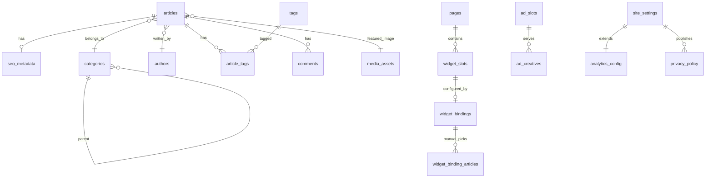

# ADR-001 — Domínio do portal de notícias

| Campo | Valor |
|-------|-------|
| Status | Aceito (schema v1 completo) |
| Data | 2026-07-14 |
| Jira | [NM-1](https://mlcreativehub.atlassian.net/browse/NM-1) / [NM-8](https://mlcreativehub.atlassian.net/browse/NM-8) |
| Contexto | Site único; template Notícias Mobile como contrato de layout |

## Contexto

O template HTML define widgets (`data-widget-id`), categorias, tags, SEO/CMP/GA4 e campos visuais de artigos, mas o backend Fluent ainda não existe. Este ADR formaliza o modelo PostgreSQL alinhado ao screen map.

## Decisão

Adotar **19 tabelas** em PostgreSQL, PKs UUID, colunas `snake_case`, API JSON `camelCase`, soft delete em `articles`.

DDL canônico: [`../schema/001_portal_noticias.sql`](../schema/001_portal_noticias.sql) · catálogo humano: [`../domain/DATABASE-SCHEMA.md`](../domain/DATABASE-SCHEMA.md).

### Grupos de entidades

| Grupo | Tabelas | Capacidade |
|-------|---------|------------|
| Editorial | `articles`, `categories`, `tags`, `article_tags`, `authors`, `comments`, `media_assets` | Cadastro de notícias + tagueamento |
| SEO | `seo_metadata` | Head / OG / JSON-LD |
| Layout | `pages`, `widget_slots`, `widget_bindings`, `widget_binding_articles` | Screen map / destaques |
| Navegação | `menu_items` | Header / footer / offcanvas |
| Site | `site_settings`, `social_links`, `analytics_config` | Configuração + Analytics |
| Ads | `ad_slots`, `ad_creatives`, `google_ads_config` | Banners + Consent Mode |
| Privacidade | `privacy_policy` | LGPD / CMP (versão) |

### Binding de widgets

- `widget_slots.widget_id` = `data-widget-id` do template (ex.: `home-1.hero`)
- `widget_bindings.source_type` ∈ `manual | category | tag | trending | recent | popular | author | static`
- Curadoria manual em `widget_binding_articles` (`sort_order`, `pinned_until`; janela em `start_at`/`end_at` no binding)

### SEO

`seo_metadata` polimórfica: `entity_type` ∈ `article | category | page | site | author | tag`; defaults do site com `entity_type = site` e `entity_id` nulo.

### Consentimento / analytics / ads

- Escolha do visitante: **client-side** (`localStorage['noticiasmobile-consent']`)
- Banco guarda: textos legais (`privacy_policy`), flags (`cmp.enabled` em `site_settings`), IDs GA/GTM (`analytics_config`), config Ads (`google_ads_config.consent_mode_enabled = true`)
- Creatives não carregam sem `ad_storage=granted` (Consent Mode v2)

## Diagrama ER

## Seeds

Ver [`../seeds/`](../seeds/) — layout regenerável via `scripts/regenerate_layout_seeds.py`.

## Consequências

- Positivo: contrato estável template ↔ CMS; SEO, LGPD, tags e config modelados desde o início
- Negativo: curadoria de widgets exige UI de backoffice (pós-schema)
- Adiado: auth, newsletter server-side, busca full-text, scraper, i18n, métricas CTR

## Referências

- `News-Website-Template/screen-map.json` / `docs/SCREEN-MAP.md`
- `News-Website-Template/docs/CATEGORIES.md` / `docs/TAGS.md`
- `docs/domain/DATA-INVENTORY.md`
- `docs/domain/widget-id-matrix.json`
- `docs/domain/ENTITIES-VALIDATION.md`
